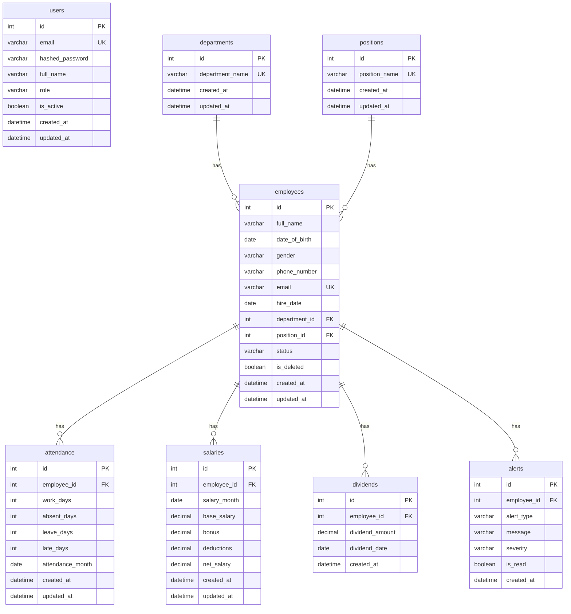

# PHASE 1: CONTRACT — PHÂN TÍCH & THIẾT KẾ HOÀN CHỈNH

---


thanh điều hướng:
-Bảng dashboard:quản lí người dùng(hiển thị tổng số người dùng), hiệu suất theo tháng(sẽ hiển thị tăng hoặc giảm và hiển thị số phần trăm tăng/giảm nếu tăng thì là dấu mũi tên màu xanh đi lên còn giảm sẽ là dấu mũi tên màu đỏ đi xuống), pay roll(làm biểu đồ tròn hiển thị doanh số số lương từng phòng ban), hiển thị tất cả nhân viên hoạt động gần đây( ở phía cuối cùng sẽ hiển thị tên nhân viên đã hoạt động gần đây, lương của từng nhân viên), biểu đồ cột nhân viên nghỉ nhiều buổi nhất (khoảng 5api)
-Quản lí nhân viên: hiển thị tên nhân viên trong đó có thể thêm sửa xóa, xuất PDF, phòng ban chức vụ (6api)
-Payroll: quản lí tiền lương nhân viên( sẽ hiển thị tên nhân viên, và hiển thị tiền lương tháng trước và tiền lương tháng này) (5api)
-Attendence(quản lí số buổi):hiển thị số buổi (2-3 api)
-Trạng thái: làm biểu đồ tròn sẽ có nhân nhiên còn làm và nhân viên nghỉ việc, đi làm trể (1api)
-Cảnh báo: về số lương, nghỉ quá nhiều, biến động về lương (1-2 api)

## 1.1 PHÂN TÍCH YÊU CẦU

### 1. Actors (Người dùng hệ thống)

| Actor | Mô tả |
|-------|--------|
| **Admin/HR Manager** | Quản lý toàn bộ hệ thống: nhân viên, lương, chấm công, cảnh báo |
| **Manager (Trưởng phòng)** | Xem dashboard, quản lý nhân viên phòng ban mình |
| **Accountant (Kế toán)** | Quản lý payroll, xem lương, xuất báo cáo |

> **Giả định**: Hệ thống hiện tại chưa yêu cầu authentication phức tạp, nên sẽ thiết kế JWT placeholder, tất cả API đều accessible cho authenticated user.

### 2. Entities (Đối tượng dữ liệu)

| Entity | Mô tả | Nguồn DB |
|--------|--------|----------|
| **Department** | Phòng ban | HUMAN.Departments |
| **Position** | Chức vụ | HUMAN.Positions |
| **Employee** | Nhân viên | HUMAN.Employees |
| **Dividend** | Cổ tức/thưởng | HUMAN.Dividends |
| **Attendance** | Chấm công theo tháng | payroll_2026.attendance |
| **Salary** | Bảng lương hàng tháng | payroll_2026.salaries |
| **Alert** | Cảnh báo (CHƯA CÓ trong DB) | Cần tạo mới |
| **User** | Tài khoản đăng nhập (CHƯA CÓ) | Cần tạo mới |

### 3. Use Cases theo từng Module

#### Module 1: Dashboard (~5 API)
- UC-D1: Xem tổng số người dùng/nhân viên
- UC-D2: Xem hiệu suất theo tháng (% tăng/giảm so với tháng trước)
- UC-D3: Xem biểu đồ tròn payroll theo phòng ban
- UC-D4: Xem danh sách nhân viên hoạt động gần đây (tên + lương)
- UC-D5: Xem biểu đồ cột nhân viên nghỉ nhiều buổi nhất

#### Module 2: Quản lý Nhân viên (~6 API)
- UC-E1: Xem danh sách nhân viên (filter, search, pagination)
- UC-E2: Xem chi tiết nhân viên
- UC-E3: Thêm nhân viên mới
- UC-E4: Cập nhật thông tin nhân viên
- UC-E5: Xóa nhân viên (soft delete)
- UC-E6: Xuất PDF danh sách nhân viên

#### Module 3: Payroll (~5 API)
- UC-P1: Xem danh sách lương (tên NV + lương tháng trước + lương tháng này)
- UC-P2: Xem chi tiết lương nhân viên
- UC-P3: Tạo bảng lương tháng
- UC-P4: Cập nhật lương nhân viên
- UC-P5: Thống kê lương theo phòng ban

#### Module 4: Attendance (~3 API)
- UC-A1: Xem danh sách chấm công theo tháng
- UC-A2: Tạo/cập nhật chấm công nhân viên
- UC-A3: Thống kê chấm công (tổng ngày đi làm, nghỉ, phép)

#### Module 5: Trạng thái (~1 API)
- UC-S1: Biểu đồ tròn trạng thái NV (đang làm, nghỉ việc, đi làm trễ)

#### Module 6: Cảnh báo (~2 API)
- UC-AL1: Xem danh sách cảnh báo (lương, nghỉ quá nhiều, biến động lương)
- UC-AL2: Tạo/tính toán cảnh báo tự động

### 4. Mối quan hệ giữa Entities

```
Department 1──N Employee N──1 Position
                  │
                  ├── 1──N Attendance
                  ├── 1──N Salary
                  └── 1──N Dividend
```

- Department (1) → (N) Employees
- Position (1) → (N) Employees
- Employee (1) → (N) Attendance records
- Employee (1) → (N) Salary records
- Employee (1) → (N) Dividends

### 5. Điểm chưa rõ & Quyết định

| # | Câu hỏi | Quyết định |
|---|---------|------------|
| 1 | "Hiệu suất theo tháng" — hiệu suất tính bằng gì? | → Dùng tỷ lệ đi làm (WorkDays / tổng ngày) so sánh tháng trước |
| 2 | "Nhân viên hoạt động gần đây" — hoạt động là gì? | → NV có bản ghi attendance/salary gần nhất |
| 3 | "Đi làm trễ" — DB không có field late | → Thêm field `LateDays` vào bảng Attendance |
| 4 | Authentication — chưa có bảng Users | → Tạo bảng Users với JWT auth |
| 5 | "Biến động lương" — ngưỡng bao nhiêu? | → > 20% thay đổi giữa 2 tháng liên tiếp |
| 6 | "Nghỉ quá nhiều" — ngưỡng? | → > 5 ngày nghỉ/tháng |

---

## 1.2 DOMAIN MODELING

### Mapping DB Tables → Entities

| Entity | Table hiện tại | DB |
|--------|---------------|-----|
| Department | Departments (HUMAN) + departments_payroll (payroll) | → Gộp thành 1 bảng `departments` |
| Position | Positions (HUMAN) + positions_payroll (payroll) | → Gộp thành 1 bảng `positions` |
| Employee | Employees (HUMAN) + employees_payroll (payroll) | → Gộp thành 1 bảng `employees` |
| Attendance | attendance (payroll) | → `attendance` |
| Salary | salaries (payroll) | → `salaries` |
| Dividend | Dividends (HUMAN) | → `dividends` |
| Alert | **MỚI** | → `alerts` |
| User | **MỚI** | → `users` |

### ERD (Mermaid)



### Tables/Fields cần thêm

| Table | Field mới | Lý do |
|-------|-----------|-------|
| `attendance` | `late_days` INT DEFAULT 0 | Yêu cầu "đi làm trễ" trong biểu đồ trạng thái |
| `attendance` | `updated_at` DATETIME | Tracking changes |
| `salaries` | `updated_at` DATETIME | Tracking changes |
| `alerts` | **BẢNG MỚI** | Lưu cảnh báo lương/nghỉ/biến động |
| `users` | **BẢNG MỚI** | Authentication |
| `employees` | `is_deleted` BOOLEAN | Soft delete |

### Đề xuất Index

```sql
-- Dashboard queries
CREATE INDEX idx_employees_status ON employees(status);
CREATE INDEX idx_employees_department ON employees(department_id);
CREATE INDEX idx_attendance_month ON attendance(attendance_month);
CREATE INDEX idx_attendance_employee_month ON attendance(employee_id, attendance_month);
CREATE INDEX idx_salaries_month ON salaries(salary_month);
CREATE INDEX idx_salaries_employee_month ON salaries(employee_id, salary_month);

-- Report queries
CREATE INDEX idx_employees_hire_date ON employees(hire_date);
CREATE INDEX idx_alerts_type ON alerts(alert_type);
CREATE INDEX idx_alerts_employee ON alerts(employee_id);
CREATE INDEX idx_alerts_is_read ON alerts(is_read);

-- Auth
CREATE UNIQUE INDEX idx_users_email ON users(email);
```

---

## 1.3 API CONTRACT

### Common Response Format

```json
// Success response
{
  "success": true,
  "data": { ... },
  "message": "Success"
}

// Error response
{
  "success": false,
  "data": null,
  "error": {
    "code": "RESOURCE_NOT_FOUND",
    "message": "Employee with id 999 not found"
  }
}

// Paginated response
{
  "success": true,
  "data": {
    "items": [ ... ],
    "total": 100,
    "page": 1,
    "page_size": 20,
    "total_pages": 5
  },
  "message": "Success"
}
```

### Error Code Convention

| Code | HTTP Status | Mô tả |
|------|-------------|--------|
| VALIDATION_ERROR | 422 | Input không hợp lệ |
| RESOURCE_NOT_FOUND | 404 | Không tìm thấy resource |
| RESOURCE_EXISTS | 409 | Resource đã tồn tại |
| UNAUTHORIZED | 401 | Chưa đăng nhập |
| FORBIDDEN | 403 | Không có quyền |
| INTERNAL_ERROR | 500 | Lỗi server |

---

### Module 1: Dashboard APIs

| # | Method | URL | Mô tả | Auth |
|---|--------|-----|--------|------|
| D1 | GET | `/api/v1/dashboard/summary` | Tổng quan: tổng NV, NV mới tháng này, NV nghỉ việc | Yes |
| D2 | GET | `/api/v1/dashboard/performance` | Hiệu suất tháng: % tăng/giảm vs tháng trước | Yes |
| D3 | GET | `/api/v1/dashboard/payroll-by-department` | Biểu đồ tròn lương theo phòng ban | Yes |
| D4 | GET | `/api/v1/dashboard/recent-activities` | NV hoạt động gần đây + lương | Yes |
| D5 | GET | `/api/v1/dashboard/top-absent-employees` | Biểu đồ cột NV nghỉ nhiều nhất | Yes |

**D1** `GET /api/v1/dashboard/summary`
- Query: `?month=2026-04` (optional, default current month)
- Response:
```json
{
  "total_employees": 150,
  "active_employees": 140,
  "new_employees_this_month": 5,
  "resigned_employees": 3,
  "change_percentage": 2.5,
  "change_direction": "up"
}
```

**D2** `GET /api/v1/dashboard/performance`
- Query: `?month=2026-04`
- Response:
```json
{
  "current_month": "2026-04",
  "current_performance": 92.5,
  "previous_performance": 89.0,
  "change_percentage": 3.5,
  "change_direction": "up"
}
```

**D3** `GET /api/v1/dashboard/payroll-by-department`
- Query: `?month=2026-04`
- Response:
```json
{
  "month": "2026-04",
  "departments": [
    { "department_id": 1, "department_name": "Phòng Nhân sự", "total_salary": 50000000, "percentage": 15.5 }
  ],
  "total_payroll": 322000000
}
```

**D4** `GET /api/v1/dashboard/recent-activities`
- Query: `?limit=10`
- Response:
```json
{
  "items": [
    { "employee_id": 1, "full_name": "Nguyễn Văn An", "department_name": "Phòng Nhân sự", "net_salary": 12300000, "last_activity_date": "2026-04-10" }
  ]
}
```

**D5** `GET /api/v1/dashboard/top-absent-employees`
- Query: `?month=2026-04&limit=5`
- Response:
```json
{
  "month": "2026-04",
  "employees": [
    { "employee_id": 5, "full_name": "Võ Thành Đạt", "department_name": "Phòng Hành chính", "absent_days": 5, "leave_days": 2 }
  ]
}
```

---

### Module 2: Employee APIs

| # | Method | URL | Mô tả | Auth |
|---|--------|-----|--------|------|
| E1 | GET | `/api/v1/employees` | Danh sách NV (search, filter, pagination) | Yes |
| E2 | GET | `/api/v1/employees/{id}` | Chi tiết NV | Yes |
| E3 | POST | `/api/v1/employees` | Tạo NV mới | Yes |
| E4 | PUT | `/api/v1/employees/{id}` | Cập nhật NV | Yes |
| E5 | DELETE | `/api/v1/employees/{id}` | Soft delete NV | Yes |
| E6 | GET | `/api/v1/employees/export/pdf` | Xuất PDF danh sách NV | Yes |

**E1** `GET /api/v1/employees`
- Query: `?page=1&page_size=20&search=Nguyen&department_id=1&status=Đang làm việc&sort_by=full_name&sort_order=asc`
- Response: Paginated list

**E3** `POST /api/v1/employees`
- Body:
```json
{
  "full_name": "Nguyễn Văn An",
  "date_of_birth": "1990-02-15",
  "gender": "Nam",
  "phone_number": "0901234567",
  "email": "an.nguyen@company.vn",
  "hire_date": "2020-01-10",
  "department_id": 1,
  "position_id": 1,
  "status": "Đang làm việc"
}
```
- Response: 201 Created + employee object

**E4** `PUT /api/v1/employees/{id}`
- Body: All fields optional (partial update)
- Response: 200 + updated employee

**E5** `DELETE /api/v1/employees/{id}`
- Response: 200 + success message (soft delete)

**E6** `GET /api/v1/employees/export/pdf`
- Query: `?department_id=1&status=Đang làm việc`
- Response: `application/pdf` file

---

### Module 3: Payroll APIs

| # | Method | URL | Mô tả | Auth |
|---|--------|-----|--------|------|
| P1 | GET | `/api/v1/payroll` | Danh sách lương (+ so sánh tháng trước) | Yes |
| P2 | GET | `/api/v1/payroll/{id}` | Chi tiết lương | Yes |
| P3 | POST | `/api/v1/payroll` | Tạo bảng lương | Yes |
| P4 | PUT | `/api/v1/payroll/{id}` | Cập nhật lương | Yes |
| P5 | GET | `/api/v1/payroll/statistics` | Thống kê lương theo phòng ban | Yes |

**P1** `GET /api/v1/payroll`
- Query: `?month=2026-04&page=1&page_size=20&department_id=1`
- Response:
```json
{
  "items": [
    {
      "salary_id": 1,
      "employee_id": 1,
      "full_name": "Nguyễn Văn An",
      "department_name": "Phòng Nhân sự",
      "current_month": { "salary_month": "2026-04", "base_salary": 12000000, "bonus": 500000, "deductions": 200000, "net_salary": 12300000 },
      "previous_month": { "salary_month": "2026-03", "base_salary": 12000000, "bonus": 400000, "deductions": 200000, "net_salary": 12200000 },
      "change_percentage": 0.82,
      "change_direction": "up"
    }
  ],
  "total": 10,
  "page": 1,
  "page_size": 20,
  "total_pages": 1
}
```

---

### Module 4: Attendance APIs

| # | Method | URL | Mô tả | Auth |
|---|--------|-----|--------|------|
| A1 | GET | `/api/v1/attendance` | Danh sách chấm công theo tháng | Yes |
| A2 | POST | `/api/v1/attendance` | Tạo chấm công | Yes |
| A3 | PUT | `/api/v1/attendance/{id}` | Cập nhật chấm công | Yes |

**A1** `GET /api/v1/attendance`
- Query: `?month=2026-04&page=1&page_size=20&employee_id=1`
- Response: Paginated attendance records

---

### Module 5: Status API

| # | Method | URL | Mô tả | Auth |
|---|--------|-----|--------|------|
| S1 | GET | `/api/v1/status/overview` | Biểu đồ tròn trạng thái NV | Yes |

**S1** `GET /api/v1/status/overview`
- Response:
```json
{
  "total_employees": 150,
  "statuses": [
    { "status": "Đang làm việc", "count": 120, "percentage": 80.0 },
    { "status": "Nghỉ việc", "count": 15, "percentage": 10.0 },
    { "status": "Nghỉ phép", "count": 5, "percentage": 3.33 },
    { "status": "Thử việc", "count": 5, "percentage": 3.33 },
    { "status": "Thực tập", "count": 3, "percentage": 2.0 },
    { "status": "Đi làm trễ", "count": 2, "percentage": 1.33 }
  ]
}
```

---

### Module 6: Alert APIs

| # | Method | URL | Mô tả | Auth |
|---|--------|-----|--------|------|
| AL1 | GET | `/api/v1/alerts` | Danh sách cảnh báo | Yes |
| AL2 | POST | `/api/v1/alerts/generate` | Tạo cảnh báo tự động | Yes |

**AL1** `GET /api/v1/alerts`
- Query: `?page=1&page_size=20&alert_type=salary_change&is_read=false`
- Response: Paginated alerts

Alert types:
- `excessive_absence` — Nghỉ quá nhiều (>5 ngày/tháng)
- `salary_change` — Biến động lương (>20% thay đổi)
- `salary_anomaly` — Bất thường về lương

---

## 1.4 CONTRACT REVIEW — ĐÃ DUYỆT

### Checklist:
- ✅ Tất cả endpoint đủ cho frontend hoạt động
- ✅ Không có endpoint thừa
- ✅ Response schema nhất quán (wrapper + pagination)
- ✅ Naming convention thống nhất (snake_case, RESTful)
- ✅ HTTP status code đúng chuẩn REST
- ✅ List API đều có filter/sort/search params
- ✅ API versioned `/api/v1/`
